# *CodownBook* : a document generation plugin of IntelliJ IDEA


## What is CodownBook?

CodownBook is an efficient document generation plugin of IntelliJ IDEA. It was successfully  published and deployed in the [JetBrains Marketplace](https://plugins.jetbrains.com/plugin/18053-codownbook) !

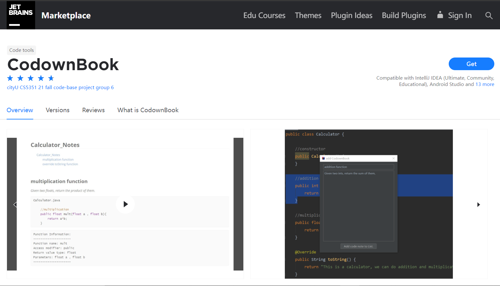


It supports managing multiple notes and exporting them in a simple way. Specifically, it contains those attributes:

1. Extract the function information(function name, return type, paramters, access modifier)

2. Take some notes without modifiying the source file

3. Manage multiple notes in a tool window

4. Display the notes in a tool window

5. Export the notes with a given template

6. Select a path to save the output file


## How to run CodowBook's source code in your PC?

1. Make sure your PC has installed Java 8 and IntelliJ IDEA 2019.2.4.

2. Git clone this repository( zhc_dev branch) in your PC.

3. Open the CodownBook folder in IntelliJ IDEA as a project.

3. Configure "File -> Project Structure" and "Run Configurations"(in the top-right of the IntelliJ IDEA, between the green hammer and the green triagnle icons) in  IntelliJ IDEA. The deatails  are shown as follow:

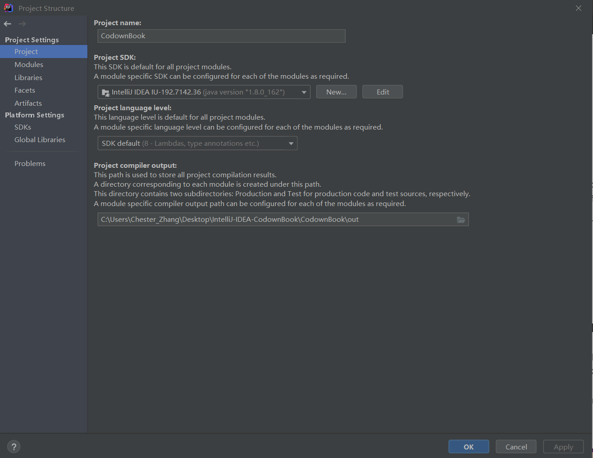


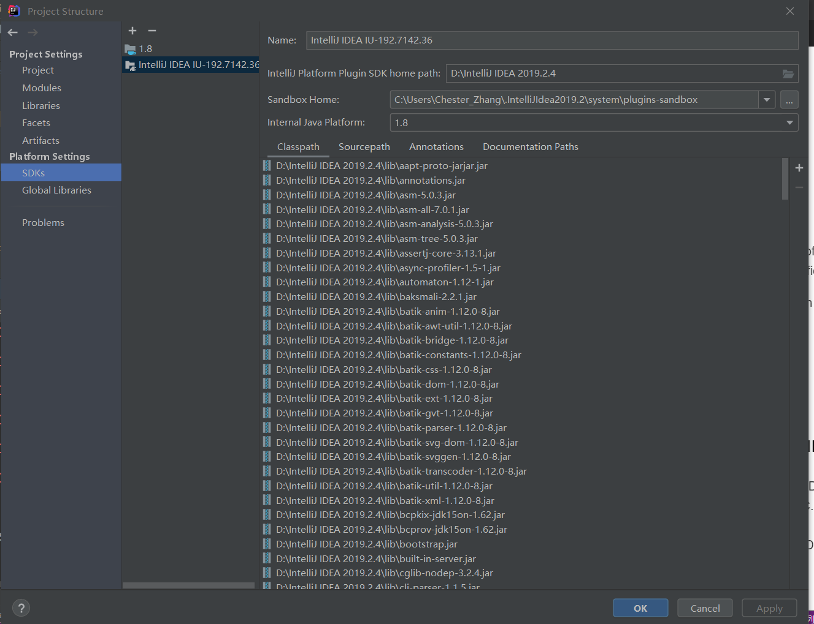


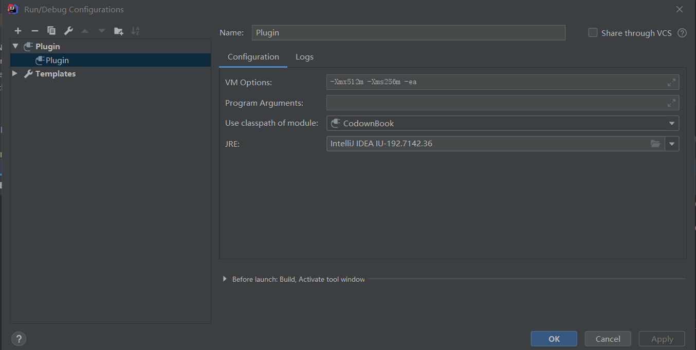


**Note: The project's SDK is  Intellij IDEA UI-192.7.142.36( the version might be a little different in your PC, but it should a IntelliJ IDEA UI SDK). And make sure that the SDKs are identical in the configurations(just the threee picture shown above).** 


5. Click the run icon (a green triangle icon) in the top-right of the IntelliJ IDEA, and our plugin start running. Then it pop a new window to let you open a new project, and we can test our plugin in the new window. 

6. You can open the CodownBookTest folder(also a IntelliJ project) to test our plugin. And you can see there are four java files in the /src folder. The Calculator.java is the file which we show in our video. The AccModifierTest.java is the file where we test whether the plugin can identify the access modifier. The ParmTest.java is the file where we test whether the plugin can identify the parameters. The ReturnTypeTest.java is the file where we test whether the plugin can identify the return type.

### How to install CodownBook in IntelliJ IDEA?
Our plugin was successfully published and deployed  in the [JetBrains marketplace](https://plugins.jetbrains.com/plugin/18053-codownbook) ! 

So,you can directly install the plugin in IntelliJ IDEA.

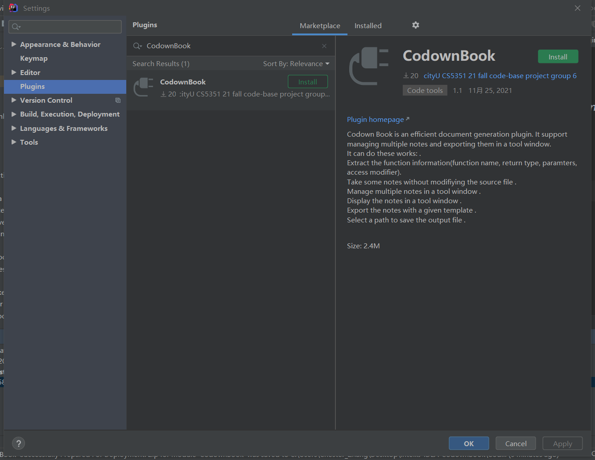


### How to use the CodownBook?
1. Click the window icon in the bottom-left corner, click "CodownBook window",  then it would open a tool window in the IDE.


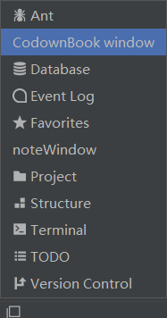


2. Select a function in the java file, then  right click, click "Add CodownBook", then it pop a window where you can enter a tile and take note.


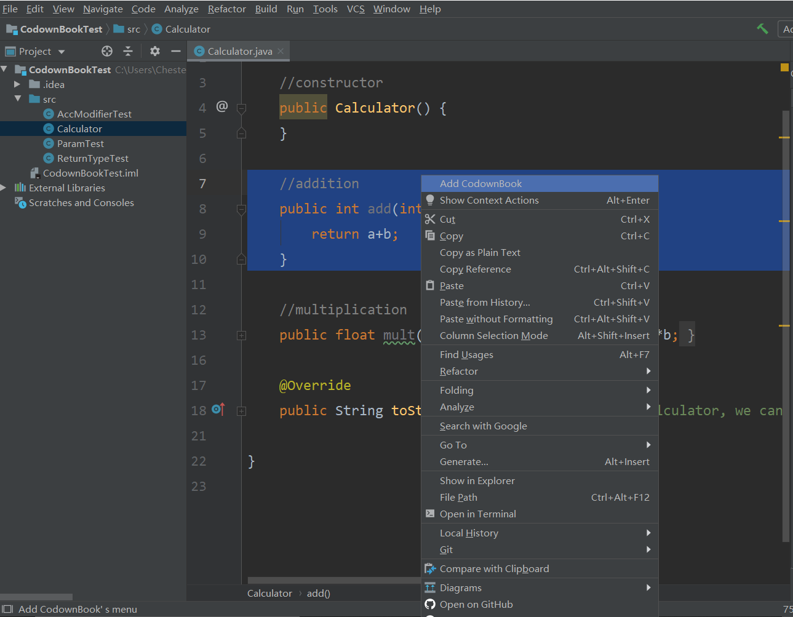

Currently, the plugin has some restrictions in identify the code. That selected text must follow this rule: "blank(s) + accessModifie  + returnType + functionName + parameter(s)". For instance: 
```
    public float mult(float a , float b){
        return a*b;
    }
```
If you forget selecting the blank(s) ahead of access modifier, or if you add other modifier like "final", "static" in function, the plugin may fail. That's what we want to improve in the following sprints.

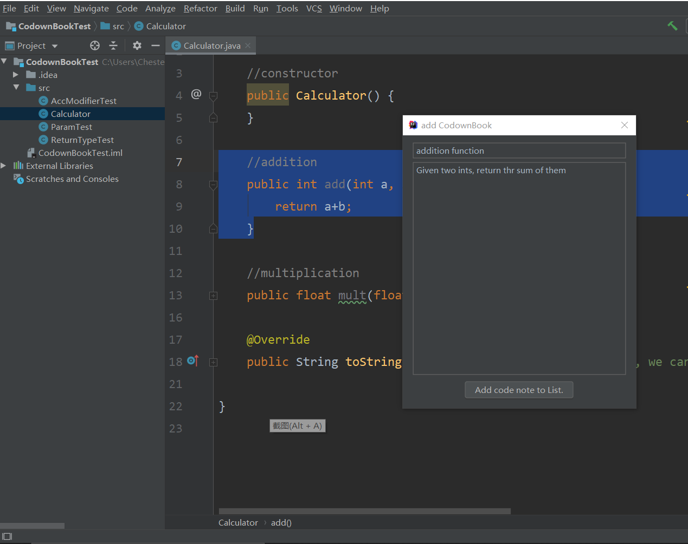

3. After entering the title and note, click "Add code note to List", then you would see the note displayed in the CodownBook window.

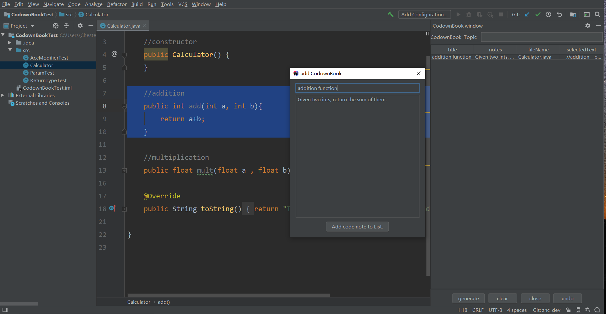

You  can manage the notes by the four buttons in the bottom of the window. The generate button can export the notes. The clear button can clear all the notes. The close button can close this window, and the undo button can undo last change on the notes. 

4. If you want to export the notes, you can enter some words in the textfied of the CodownBook window and click generate button, then it would pop a window asking you to select a pth to save the output file.

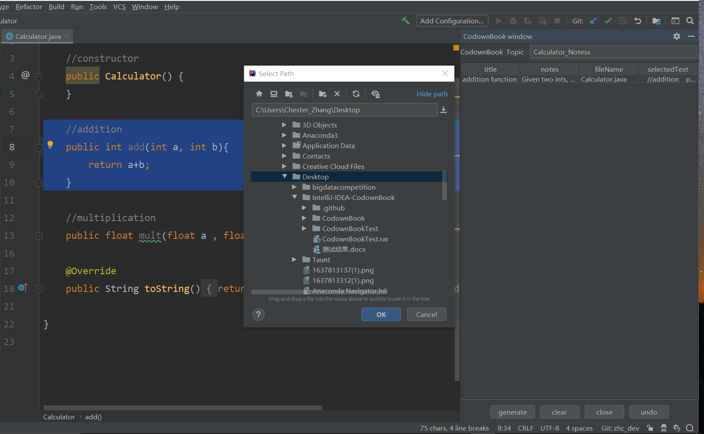


5. the output file looks like this:
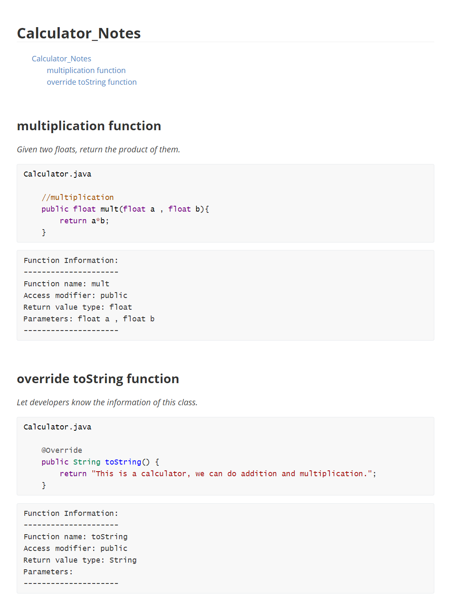

